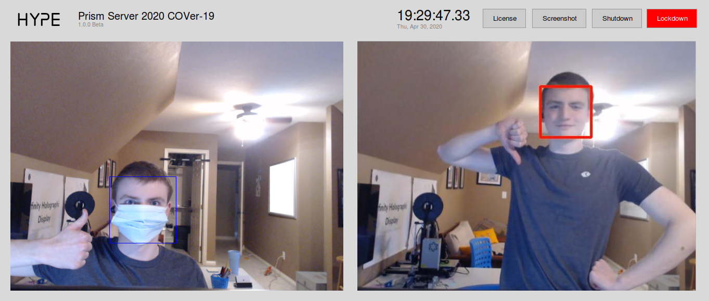

# Prism Mask Detection Community Edition COVer-19
This is a free community edition of Prism Security Suite Mask Detection. This software is able to detect people who are not wearing masks, and contact admins of the building.

In the lights of the COVID-19 Pandemic, Hype Industries has released a free Beta versions of the Prism Security Suite which has been re-purposed from detecting weapons to detect people not wearing masks. This software is still in development. Any suggestions you have would be greatly appropriated, or just get in touch to tell us how your using the software. Contact us at hello@hype-industries.com or support@hype-industries.com.



## System Requirements
We highly recommend running this on a Linux Distro. Our system is running on Deepin 15.11 with 16GB of ram and an Intel I5-2500 @ 3.30GHx4. We would highly recommend running Darkflow with a Nvidia GPU.
- Darkflow
- Tensorflow
- Python (2.7)
- openCV2 (PIP)
- request (PIP)
- ctype (PIP)
- Pillow Image (PIP)
- tkinter (PIP)
- pytesseract (PIP)

## Setup
Setting up the Mask detection is really easy. Just create a file called `hardware.json` in the root directory. The `hardware` property is an array of objects. Each Object must contain a unique name, address, and x/y position. For these attributes to be updated on the system you must restart Prism.

**Name**
Names are not case sensitive and are not space sensitive, meaning `camera 1` and `Camera1`  are not unique names. If two camera possess the same name, Prism will terminate the start process.

**Address**
The address can either be represented by an integer which represents local web cameras (starting at `0`) or an IP Camera address. IP cameras can be accessed either from the HTTP/HTTPS or RTSP protocols (We use OpenCV2 for video capture). For example to access a JPG stream from an IP Camera the address might be `http://192.169.1.19:8080/video`.

**Positioning**
The `x_pos` and `y_pos` are required and set the images position on the grid of the Prism Dashboard. These coordinates relate to the images top left corner. In addition to these attributes you can also set `width` and `height` , which are integers.

```
hardware.json
{
    "hardware": [{
        "name": "com1",
        "address": 0,
        "x_pos": 0,
        "y_pos": 0
    }]
}
```

## License
NonCommercial-ShareAlike 4.0 International (CC BY-NC-SA 4.0)
**Attribution** — You must give appropriate credit, provide a link to the license, and indicate if changes were made. You may do so in any reasonable manner, but not in any way that suggests the licensor endorses you or your use.
**NonCommercial** — You may not use the material for commercial purposes.
**NoDerivatives** — If you remix, transform, or build upon the material, you may not distribute the modified material.
**No additional restrictions** — You may not apply legal terms or technological measures that legally restrict others from doing anything the license permits.

THE SOFTWARE IS PROVIDED "AS IS", WITHOUT WARRANTY OF ANY KIND, EXPRESS OR IMPLIED, INCLUDING BUT NOT LIMITED TO THE WARRANTIES OF MERCHANTABILITY, FITNESS FOR A PARTICULAR PURPOSE AND NONINFRINGEMENT. IN NO EVENT SHALL THE AUTHORS OR COPYRIGHT HOLDERS BE LIABLE FOR ANY CLAIM, DAMAGES OR OTHER LIABILITY, WHETHER IN AN ACTION OF CONTRACT, TORT OR OTHERWISE, ARISING FROM, OUT OF OR IN CONNECTION WITH THE SOFTWARE OR THE USE OR OTHER DEALINGS IN THE SOFTWARE.
